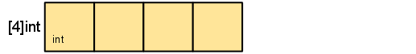

# Composite Types
In the previous section we have discussed the basic types, in this one we'll take a look at how to combine these basic types into **composite types**. There are 4 such types:

1. Arrays
2. Slices
3. Maps
4. Structs

Arrays and structs are **aggregate types**, meaning that their values are concatenations of of other values in memory. They also are **fixed size** whereas **slices** and maps are dynamic data structures that grow as values are added.

## Arrays
In computer science an [array][1] is a data structure consisting of a collection of elements (values or variables), each identified by one or more indices.

Arrays in Go have the following characteristics:

* Arrays are linearly ordered collections of elements.
* They are **homogeneous**, all of the elements of an array must belong to a single type. For example, we cannot assign a float value to an element in an array of integers.
* The elements in an array are **mutable**, we can change their values as long as we respect the type of the array.
* Arrays are **static**, they have a **fixed length**, and this length is part of its type.

### Declaring arrays
In Go we declare an array using the following syntax in its general form:
```
var name[length]type
```

* It starts with the `var` keyword, as every variable declaration.
* Then the `name` of the array.
* Enclosed in square brackets is the **length** of the array (otherwise it would be a slice)
* Finally the **type** of its elements.

Let’s see an example:
```Go
func main() {

	var a [4]int

	fmt.Printf("The array 'a': %v \n", a)
	fmt.Printf("The length of 'a' is: %d \n", len(a))
}
```

Above we have defined an array named `a`, with space for 4 integer values. If we run the code:
```
$ go run arrays/arr1/main.go
The array 'a' has: [0 0 0 0]
The length of 'a' is: 4
```

As we can see, since the type of this array is `int`, their elements has been automatically initialized to the zero value for integers, `0`.

> Check the Go specification about [the zero value][18] for more information.

Every array declaration produces a a **ready-to-use** array whose elements are themselves zeroed. We can start reassigning values right away, a bit later we are gonna learn how.

#### A shorter syntax
When inside a function, we can also use the short syntax for array declarations:
```
name := [length]type{}
```

This syntax is very convenient, it allows us to initialize the values of an array at the same time we declare it. For example:
```Go
a := [4]int{33, 4, 12, 13}
```

Sometimes arrays can get too long to fit on one line, so Go allows you to break it up like this:
```Go
a := [4]int{
  33,
  4,
  12,
  13,
}
```

Notice the **extra trailing comma**, after the last element. This is **required** by Go and it allows us to easily rearrange the position of the elements without having to worry about taking away the comma after the last one. It also comes in handy to remove an element from the array by commenting out its line, in that case the value at that position is zeroed. (it does not remove the element, arrays have fixed length)

### Automatic length
Also, we can pass an **ellipsis** for the **length** when we initialize, so the compiler will count the elements for us:
```Go
a := [...]int{
  33,
  4,
  12,
  13,
}
```

The output shows how the length is correctly inferred from the amount of elements:
```
$ go run arrays/arr4/main.go
The array 'a': [33 4 12 13]
The length of 'a' is: 4
```

### Accessing arrays
The elements in an array are arranged sequentially from left to right. Each element has an associated index. We can access the value on each element using its index inside the index operator (`[]`). For example:
```Go
var a [4]int

a[0], a[1], a[2] = 22, 44, 78
a[3] = a[0] + a[2]
```

In this example we have assigned values to the first three elements of the array and added the values of the first (`a[0]`) and third (`a[2]`) ones, and assigned the result to the last element (`a[3]`). And this is the output:
```
$ go run arrays/arr5/main.go
The array 'a': [22 44 78 100]
The length of 'a' is: 4
```

As in many other programming languages, arrays in Go are **zero-indexed**, meaning their elements are arranged starting with 0. In other words, the first element in an array has index 0, the second has index 1 and so on.

| a := []int{44, 22, 78, 122} |                      |
|:----------------------------|:---------------------|
| Value                       | 22  |	44  | 78  | 122 |
| Index                       | 0   | 1   | 2   | 3  |

### Length of an array
Go has available two **built-in functions** named `len()` and `cap()`. When used on arrays, both of them return the length of the array as an integer number. We have been using `len()` in our previous examples, but we could have used `cap()`, and get identical results. As we will see later on, these functions return different results when applied to **slices**.

Since array are zero-based indexed, the last element in an array has always the index `len(a) - 1`. For example:
```Go
a := [4]int{22, 44, 78, 100}

last := a[len(a) - 1]

fmt.Printf("The last element of the array is: %v \n", last)
```
And the output::
```
$ go run arrays/arr6/main.go
The last element of the array is: 100
```

If the last element in an array has always the index `len(a) - 1`, that means that an element with index `len(a)` falls right outside the limits of the array. If we try to access any element further the last element of an array, we'll get an `out of bounds` error. For example:

```Go
a := [4]int{22, 44, 78, 100}

a[len(a)] = 101

fmt.Printf("The array contains now: %v \n", a)
```

The output:
```
$ go run arrays/arr7/main.go
invalid array index len(a) (out of bounds for 4-element array)
```

#### Arrays are not resizable
In other languages, when we assign to an element out of bounds, the array grows automatically to acommodate the new element. In Go, trying to assign to an element past the bounds of an array does not increase the length of the array, but generates an **error**.

As we said, in Go *the length of an array is part of its type*, an array of four integers (`[4]int`) is a **type of array**. A `[5]int` array would be **a different type** of array.


### Multidimensional arrays
When we create an array using one index, the result is a linear data structure called **one-dimensional array**, what is known in mathematics as a **vector**. Go also supports **multidimensional arrays**.

**Two-dimensional arrays** are very popular. They are created using two indices, and the result is known as a **matrix** also by analogy with maths. Let’s create one:

```Go
var a = [3][3]int{
  {11, 22},
  {44, 55, 66},
  {77, 88, 99},
}

var matrix string

for i := 0; i < 3; i++ {
	for j := 0; j < 3; j++ {
		matrix += fmt.Sprintf("%.2d ", a[i][j])
	}
	matrix += "\n"
}

fmt.Println(matrix)
```

> [Sprintf][2] formats according to a format specifier and returns the resulting string, but doesn't print to the standard output.

Again, even though we have partially initialized the elements of this array, Go initializes the rest of the elements to `0`. If we run the program above this is the output:
```
$ go run arrays/matrix/main.go
11 22 00
44 55 66
77 88 00
```

The following diagram may help understand how the indexes work regarding the elements distribution:


### Arrays are values
Arrays are **values**. So, for example if we create an array named `a` and assign it to `b`:
```Go
a := [4]int{1, 2, 3}
b := a

a[0] = 100
fmt.Println("a =", a) // [100 2 3]
fmt.Println("b =", b) // [1 2 3]
```

In the above example `b` gets assigned its own independent copy of the array, changes made to elements of `a`, will not affect the elements in `b`. This is important to remember when we are **passing an array to a function**, it will receive a **copy of the array**, not a pointer to it. To solve this issue, we could pass a pointer to the array, but that’s not idiomatic Go. As we’ll see in the next section, that’s what **slices** are for.

> **Arrays** are values, whereas **slices** are references to an underlying array.

To sum it up, Go’s arrays are **values** not references. An array variable denotes the entire array. The in-memory representation of an array of the type `[4]int`, is just four integer values laid out sequentially:




---
[:arrow_backward:][back] ║ [:house:][home] ║ [:arrow_forward:][next]

<!-- navigation -->
[home]: ../README.md
[back]: ../README.md
[next]: workspace.md


<!-- links -->
[1]: https://en.wikipedia.org/wiki/Array_data_structure
[2]: https://golang.org/pkg/fmt/#Sprintf

<!-- images -->
[i1]: https://en.wikipedia.org/wiki/Array_data_structure
