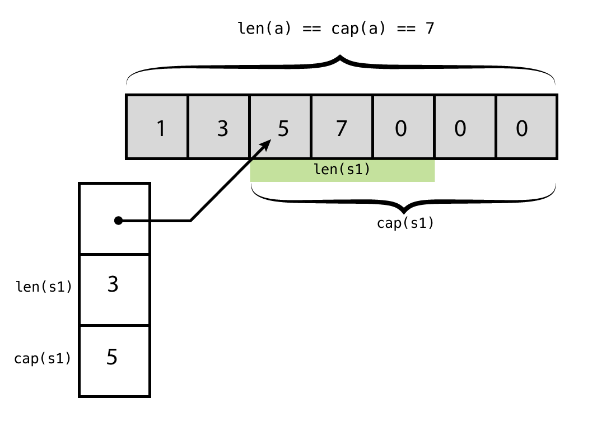
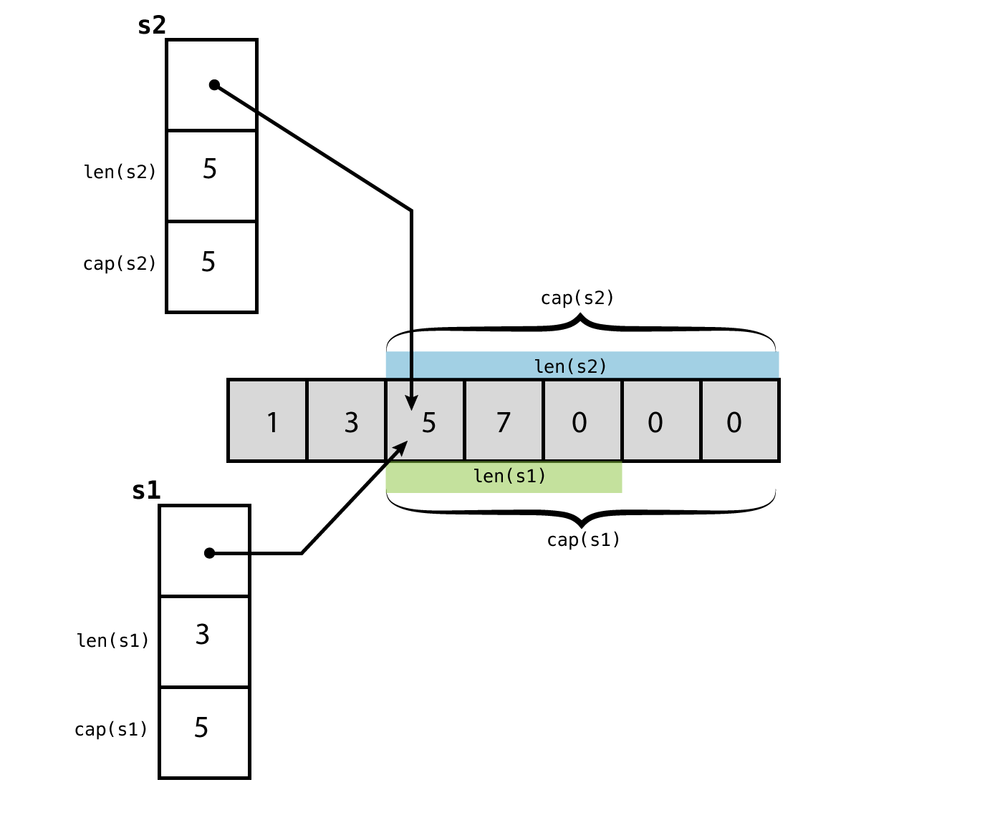

# Slices
In the previous section we have seen how **arrays** have a **fixed length**. The reason for that is that *the length of an array is part of its type*, meaning that resizing an array would imply changing its type, and that's not possible since Go is a statically typed language. Because of that, working with arrays in Go is a bit limiting.

Fortunately, Go also includes the [slice type][1], which values (known as slices) can be resized, what makes them much more flexible than arrays, and because of that, more frequently used. Both types are closely related though, being a slice an abstraction built on top of an array. In fact, [Go’s official documentation][1] consider arrays as building blocks for slices, and since a slice is always associated to an underlying array, it’s important to understand how arrays work before start working with slices.

## Creating slices
There are several ways to create a slice:

* Slicing an array.
* Slicing another slice.
* Declaring and initializing a slice.

### Slicing an array
In the last section we learned how to create arrays. Here we are gonna learn how to create slices out of arrays using slicing operations. Slicing is done using **2 indices** separated by a **colon** inside the **index operator**:
```
s[n:m]
```

The above expression takes a slice fron index `n` to `m - 1` (up to `m`, but not included). The following table shows the slicing operations available in Go:

| Syntax           | Description/result                                                     |
|:-----------------|:-----------------------------------------------------------------------|
| `s[n:m]`         | A slice taken from slice `s` from index positions `n` to `m - 1`       |
| `s[n:]`          | A slice taken from slice `s` from index positions `n` to `len(s) - 1`  |
| `s[:m]`          | A slice taken from slice `s` from index positions `0` to `m - 1`       |
| `s[:]`           | A slice taken from slice `s` from index positions `0` to `len(s) - 1`  |
| `s = s[:cap(s)]` | Increase the length of slice `s` to its capacity if they are different |

Let’s see an example:
```Go
// Creating an array
a := [7]int{1, 3, 5, 7}

// Slicing an array
s := a[2:5]
```

Here we have created an array of 7 integers but only have initialized 4 of them. Then we have created a slice out of that array. This is the output:
```
$ go run code/slices/01/main.go
The array: [1 3 5 7 0 0 0]
Length: 7
Capacity: 7

The slice: [5 7 0]
Length: 3
Capacity: 5
```

Several things to notice:
* Notice how Go has zeroed the values of the array we didn’t initialized.
* The functions `len()` and `cap()` return the same value in the case of the **array**, its **length**.
* But in the case of the **slice**, its length and capacity are different, what does that mean? To understand that, we have to dig a bit deeper in what a slice really is.

## Slice internals
We have said that a slice is always a reference to an underlying array, that’s true, but we can be more precise and say that a slice is a small data structure containing 3 parts:

A pointer to the element of the underlying array where the slice starts.
The length of the slice.
Its capacity of the underlying array.
The documentation refers to this data structure as a descriptor, and it’s also known as the slice header.

Let’s see an illustration of the slice of our last example, and how it relates to its underlying array:



In the case of the array, the `len()` and `cap()` functions return the same value: the length of the array. But regarding the slice these functions return two different values.

> There are some interesting articles about how slices work:
> * Like [this one][2] from the golang official blog
> * Or [this one][3]
> * Check also [this one][4] about a function for inspecting the slice header

## Difference between length and capacity
Slices have both a **length** and a **capacity**:

1. The **length** is the number of array elements that our slice is referencing. We can reassign values to the elements of the slice inside its length range, but it we try to do it outside it, we’ll get a `panic: runtime error`. Since the slice is just a reference to the array, all the changes made to the elements of the slice are really being made to the underlying array. We can think of the slice as just a handle or a window to a section of the array.
2. The **capacity** of the slice is the distance between the first element of the slice and the last element of the array. That means that the **capacity** of the **slice** is determined by the **length** of the underlying **array**.

The **capacity** is the *potential amount of elements* a slice can have. In the last example the slice had 3 elements, but it may have had 5. Slices are resizable, meaning that we can extend the size of a slice to its full capacity, but not more.

> The built-in functions `len()` and `cap()` return the **length** and **capacity** of a slice.

## Other ways of creating slices
We know how to create a slice using slicing operations on an array. But there are other ways of creating slices.

### Slicing a slice
We can use slicing operations on a slice, and the result will be another slice that references the same array that the original slice is pointing at.

For example, let’s use our last example and create a second slice out of the first one:
```Go
// Creating an array
a := [7]int{1, 3, 5, 7}

// Slicing an array
s1 := a[2:5]

// Slicing a slice
s2 := s1[:cap(s1)]
```

Above we have created the slice `s2` out of the slice `s1`. Both slices are referencing the same array. Notice how we have used the capacity of the first slice in our slicing operator to extend the second one. The length of `s2` is at its maximum, the length of a slice can never be bigger than its capacity. Check the following diagram:



The output of the code above:
```
$ go run code/slices/02/main.go
The array: [1 3 5 7 0 0 0]
Length: 7
Capacity? 7

The slice s1: [5 7 0]
Length: 3
Capacity: 5

The slice s2: [5 7 0 0 0]
Length: 5
Capacity: 5
```

Since we cannot use **negative indices** in slicing operations, re-slicing below the **element zero** is not possible. Re-slicing allows us to extend slices to the right, until we reach the capacity limit, but never to the left. Every time we re-slice, the resulting slice will have the same capacity as the original slice, since both of their pointers are directed at the same element of the array.

Because slices are just **references**, re-slicing operations do not copy any data from the original slice they just create new descriptors that point to different areas of the original array.

**Descriptors** created re-slicing have the same pointer and the same capacity, we can change only the length field, and always within the capacity limits.

### Declaring slices
Another way of creating slices is using **variable declarations**. A slice is declared just like an array, except that we **omit the length** (otherwise it would be an array):

```Go
// Declaring a slice
var s []byte

// Initializing a slice
s = make([]byte, 5, 5)

// Slicing
s = s[2:4]
```

In this example we have created a slice, whose elements are of the type byte. This is the output:
```
$ go run code/slices/03/main.go
The slice is: [0 0]
The length of the slice is: 2
The cap of the slice is: 3
slice == nil?: false
```
From this output it looks like we have created an **empty slice**, but it’s not that. If you look at the last line, its value is `nil`, what means that the slice is not pointing to any array, it’s an **unitialized slice**. As opposed to arrays, a slice is not ready to be used until we initialize it. If we try to write a value to a nil slice, we will get a **runtime error**:
```Go
// Declaring a slice
var s []byte

// Trying to assign to an unitialized slice
s[0] = 32
```

If we try to run the code:
```
$ go run code/slices/04/main.go
panic: runtime error: index out of range
...
```

Slices have to be initialized before being used, next we are gonna see how.

### Initializing slices
We can initialize slices in several ways, one of them is using a built-in function called make. This function can take 3 arguments:

1. A **type**, which has to be the same as the type used when declaring the slice.
2. A **length**.
3. An optional **capacity**.

When called on a slice, `make()` allocates a **new array** in memory and returns a slice that refers to that array. For example:
```Go
// Declaring a slice
var s []byte

// Initializing a slice
s = make([]byte, 5)
```

Check the output of this code:
```
$ go run code/slices/05/main.go
The slice is: [0 0 0 0 0]
The length of the slice is: 5
The cap of the slice is: 5
slice == nil?: false
```

In this case our slice is not a `nil` reference anymore, now it’s pointing to an array of 5 elements, all of them are initialize with a value of `0`. Like in the following diagram:


Notice also that the **length** and **capacity** of the slice are the same, this is because `make()` created an array big enough to accommodate the slice. If we want to create an array bigger we have to use the optional third argument.

#### Specifying a capacity
If we need an array bigger than the slice, we can specify a **capacity** and pass it as the the **third argument** to `make()`. The capacity has to be equal or bigger than the length of the slice. For example:
```Go
// Declaring a slice
var s1 []byte

// Initializing a slice
s1 = make([]byte, 5, 8)

// Slicing a slice
s2 := s1[:cap(s1)]
```

Here we have specified a **capacity** (8) bigger than the **length** of the slice (5), so `make()` allocates an array with 8 elements. The second slice takes advantage of this bigger array. Check the output:
```
$ go run code/slices/06/main.go

s1: [0 0 0 0 0]
The length of s1: 5
The cap of s1: 8

s2: [0 0 0 0 0 0 0 0]
The length of s2 is: 8
The cap of s2 is: 8
```

### Using composite literal syntax
Finally, the last way of creating slices is using literal notation. This is a very convenient syntax that allows us to declare and initialize a slice altogether. For example:
```Go
// Short syntax for creating slices
s := []int{33, 3, 5}
```

Here we are declaring and initializing a **slice** with 3 integer elements, which basically is like declaring an array, the only difference is the missing **length** between the brackets. This syntax implicitly creates the underlying array for us. Since we have to define all of its elements, the **length** and **capacity** of slices created this way will always be the same.

> The same as with arrays, we can break up the assignments in several lines.

## Arrays are values, slices are references
Arrays are **values**, whereas slices are **references** to those values. This has important implications:

1. Overlapping slices. Slices hold references to an underlying array, and if you assign one slice to another, both refer to the same array.
2. Functions. If a function takes a slice argument, changes it makes to the elements of the slice will be visible to the caller, analogous to passing a pointer to the underlying array. On the other hand, arrays are passed **by value** (i.e., copied) which is more expensive in memory terms, although this cost can be avoided by passing **pointers**. Slices are cheap to pass, because regardless of their length or capacity, they are just references. The size of a slice is **16-byte value** on 64-bit machines and as a **12-byte value** on 32-bit machines, no matter how many items it contains. This makes slice operations as efficient as manipulating array indices.

## Iterating over slices
Very often it is necessary to iterate over all the items in a slice. In those cases we use a `for` loop to iterate over the elements on an array or slice. Instead of creating a counter variable for controlling our iterations, it’s easier to use a `range` clause.

The `range` clause returns 2 values on each iteration:

1. The **key** of the element, often represented by a variable named `k`.
2. Its **value**, usually assigned to `v`.

Depending on which of these 2 values we are interested on, there are 3 ways of using a **for-range loop**:

1. Sometimes we are interested in both the **keys** and the **values**. For example:
```Go
fruits := []string{"Bananas", "Blueberries", "Raspberries"}

for i, v := range fruits {
  fmt.Printf("%d. %v\n", i+1, v)
}
```

If we run this we get:
```
$ go run code/slices/08/main.go
1. Bananas
2. Blueberries
3. Raspberries
```

2. If we need just the **keys**, it’s enough with not using the `v` variable. This maybe the case when what we want is to modify the items in the slice. For example:
```Go
fruits := []string{"Bananas", "Blueberries", "Raspberries"}

for i := range fruits {
  fmt.Printf("%d. Fruit\n", i+1)
}
```

If we run this we get:
```
$ go run code/slices/09/main.go
1. Fruit
2. Fruit
3. Fruit
```

3. Finally, there are the cases in what we want the **values** of the elements but not their keys. In these cases we have to use the **blank identifier** (`_`) to discard the returned keys. For example:
```Go
fruits := []string{"Bananas", "Blueberries", "Raspberries"}

for _, v := range fruits {
  fmt.Printf("* %v\n", v)
}
```

If we run this we get:
```
$ go run code/slices/10/main.go
* Bananas
* Blueberries
* Raspberries
```

## Slice tricks
Check this link [https://github.com/golang/go/wiki/SliceTricks][5]

---
[:arrow_backward:][back] ║ [:house:][home] ║ [:arrow_forward:][next]

<!-- navigation -->
[home]: ../README.md
[back]: composite_types.md
[next]: #


<!-- links -->
[1]: https://golang.org/ref/spec#Slice_types
[2]: http://blog.golang.org/go-slices-usage-and-internals
[3]: https://blog.golang.org/slices
[4]: http://www.goinggo.net/2013/08/understanding-slices-in-go-programming.html
[5]: https://github.com/golang/go/wiki/SliceTricks
