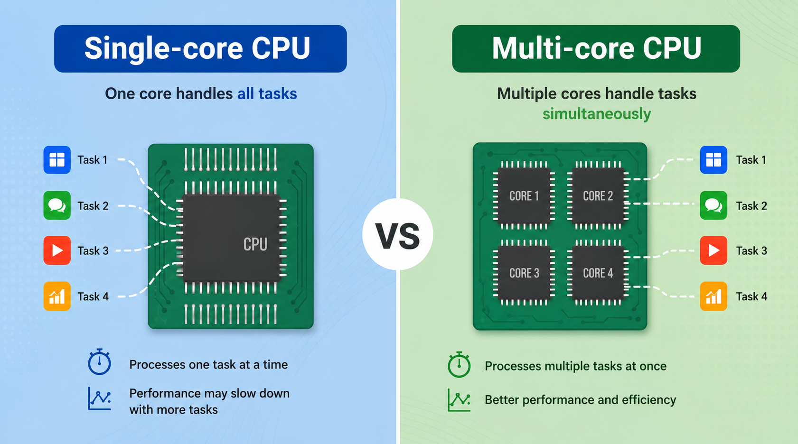
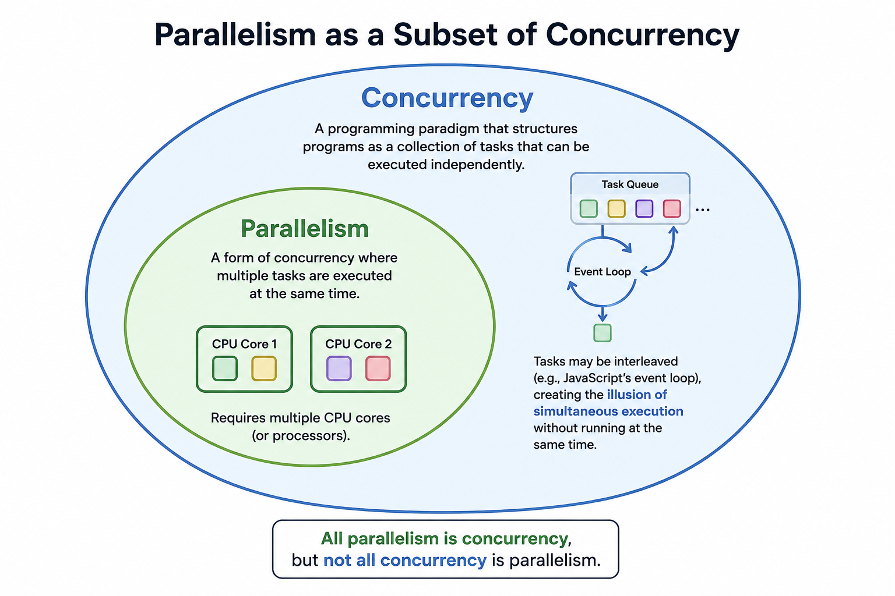

import Admonition from '@components/Admonition.astro'

# Concurrency vs Parallelism

Many developers use the terms **concurrency** and **parallelism** interchangeably, however they're not the same thing! In previous jobs, I've had a hard time explaining the difference to **non-technical** people, who are used to the term **in parallel** from their daily lives.

## Making Pizza: A Concurrency Example

Let's use an example: Imagine you're making pizza at home, alone. You don't do one thing at a time and wait for it to finish before starting the next. Instead, you juggle tasks:

1. Mix the dough and let it rest.
2. While it rests, chop tomatoes and start the sauce on the stove.
3. While the sauce simmers, cut your toppings.
4. Take the sauce off the heat so it cools, turn on the oven so it gets hot.
5. Shape the dough, add sauce and toppings, put it in the oven.

You're **one person**, but you're making progress on multiple things by switching between tasks and using waiting time wisely. This is **concurrency** — one worker, many overlapping tasks.

> [!NOTE]
> This is exactly how **JavaScript** works. It's **single-threaded** (one cook), but its event loop lets it juggle many tasks by switching between them whenever one is waiting — a network request, a timer, user input. Only one thing actually executes at any given nanosecond, but the overlap makes it feel simultaneous. This is **not parallelism**!
> 
> JavaScript handles **concurrency** via the event loop and opts into **parallelism** with Worker Threads (not super common).

## Parallelism: Invite your Friends involves Multiple Cores

Now imagine you invite three friends to help.

- You make the dough.
- Frankie chops tomatoes and handles the sauce.
- Bobby cuts the toppings.
- Tommy preheats the oven and preps the pan.

Everyone is working at the same time **in parallel**, each on their own task. This is **parallelism**, multiple workers executing simultaneously.

> [!NOTE]
> This is how **Go** (and other languages which support for parallelism) approaches it. You can spawn goroutines that run truly **in parallel** across multiple CPU cores, like separate cooks working independently in the same kitchen.

**Parallelism** solves it by having **multiple workers** doing different tasks at the exact same time. In programming, you can think of each friend as a separate thread of execution. 

Modern hardware architectures are built with [multiple cores](https://en.wikipedia.org/wiki/Multi-core_processor), so it make sense that programming languages offer a way to fully utilize the capabilities of a machine.

In **Go**, you can spawn multiple goroutines that run truly in parallel on different CPU cores. Here, **Task A** and **Task B** can both be actively progressing at the same time, each on its own thread of execution.

## Concurrent Programming

Concurrency is a programming paradigm that allows us to structure our programs as a collection of tasks that can be executed independently. It doesn't necessarily mean that these tasks will run at the same time (in parallel), but they can be interleaved in a way that gives the illusion of simultaneous execution (like JavaScript's event loop).

Parallelism is a subset of concurrency:

- Concurrency is about structure — designing tasks so they can overlap, whether or not they run at the same time. Even on a single CPU, a concurrent program interleaves tasks, switching between them during waits (I/O, timers, network) to keep the processor busy.
- Parallelism is about execution — tasks literally running simultaneously on multiple cores. But only concurrent programs can run in parallel. You can't have multiple cooks working at the same time unless the work is broken into separate tasks first. 

## The Difference

1. **Concurrency** is when we write our programs by grouping instructions into separate tasks. Some task examples could be:

- Handle HTTP requests.
- Searching for files.
- Render a frame in a videogame.

Depending on the available hardware, these tasks may or may not execute **in parallel** (for parallel execution we need multiple CPU cores). Even on a single CPU, if our code is written in a concurrent way, the system will interleave the tasks, giving the impression that is performing more that one task at a time. 

2. Parallelism requires multiple CPU cores in order to perform each task simultaneously on each core. But only **concurrent** programs can execute code in parallel. In that sense, we can say that **parallelism** is a subset of concurrency.

**Concurrency** is about planning how to do many tasks at the same time (interleaving or in parallel). **Parallelism** is about performing many tasks at the same time.

## The Cost of Concurrency

Even with a **single CPU core**, concurrency models like the **event loop** used by JavaScript offers real benefits. Most programs spend only a small proportion of their time executing computations — the majority of the time the CPU is waiting on **slow I/O** (disk, network, user input). Instead of sitting idle, a concurrent program switches to other tasks that are ready to run, making better use of that time.

This is part of why **JavaScript** became so popular. By being **single-threaded** with an **event loop**, it gives you the I/O concurrency benefits without exposing the hard parts — no shared memory, no data races, no locks. You get most of the throughput gains with a much simpler mental model.

Go takes the opposite bet: give developers powerful concurrency primitives (goroutines, channels) and trust them to use them correctly.

The tradeoff is **complexity**. Concurrent programs are significantly harder to reason about — you have to think about tasks interleaving in ways you don't fully control, shared state being accessed simultaneously, and bugs that only appear under specific timing conditions.
