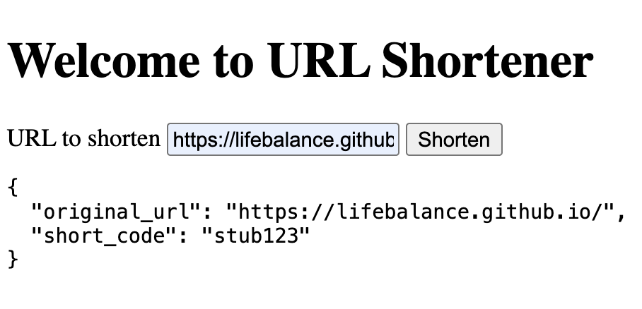

# The Shortener Endpoint

We'll create a new endpoint in our `router.go`:

```go
func NewRouter(shortener *service.Shortener) http.Handler {
    // more code...
	chi.Post("/api/shorten", shortenHandler(shortener))
    // more code...
}
```
First of all, `NewRouter` has to accept the dependency we are passing from `main`. Note also how easy is to create a new `POST` endpoint on the `/api/shorten` url.

## The Shorten Handler

We also need to create a new `shortenHandler` function:

```go
func shortenHandler(shortener *service.Shortener) http.HandlerFunc {
	return func(w http.ResponseWriter, r *http.Request) {
		if r.Method != http.MethodPost {
			w.Header().Set("Allow", http.MethodPost)
			http.Error(w, "method not allowed", http.StatusMethodNotAllowed)
			return
		}

		defer r.Body.Close()

		var req struct {
			URL string `json:"url"`
		}
		if err := json.NewDecoder(r.Body).Decode(&req); err != nil {
			http.Error(w, "invalid json payload", http.StatusBadRequest)
			return
		}
		if req.URL == "" {
			http.Error(w, "url is required", http.StatusBadRequest)
			return
		}

		resp, err := shortener.Shorten(service.ShortenRequest{URL: req.URL})
		if err != nil {
			http.Error(w, "failed to shorten url", http.StatusInternalServerError)
			return
		}

		payload := map[string]string{
			"short_code":   resp.ShortCode,
			"original_url": resp.OriginalURL,
		}

		w.Header().Set("Content-Type", "application/json")
		if err := json.NewEncoder(w).Encode(payload); err != nil {
			http.Error(w, "failed to encode response", http.StatusInternalServerError)
		}
	}
}
```

This function takes the service available in `NewRouter`.

## Adding some JavaScript

Let's add some JavaScript..

```sh
urlshortener/
├── cmd/
│   └── server/
│       └── main.go
├── ui/
│   ├── app.js               # Minimal frontend logic
│   └── index.html
└── internal/
    ├── api/
    │   └── router.go
    └── service/
        └── shortener.go
```

We need to edit our `index.html` file and add a script:

```html
<script src="/static/app.js"></script>
```

When the browser loads our HTML file, it'll request the JavaScript file to `http://<domain>/static/app.js`. To serve this JavaScript file, we need to add a new endpoint in our `NewRouter` function:

```go
	chi.Handle("/static/*",
		http.StripPrefix("/static/",
			http.FileServer(http.Dir("ui"))),
	)
```

This endpoint receives all request to `/static`, and call our `staticFilesHandler` helper:

```go
func staticFilesHandler() http.Handler {
    const prefix = "/static/"
    fs := http.FileServer(http.Dir("ui"))
    return http.StripPrefix(prefix, fs)
}
```

If we start the server and point our browser to `http://localhost:8080`, we can paste some URL to test our app:



So far, we get the original url and a **hardcoded** value for our `short_code`, but all is working.